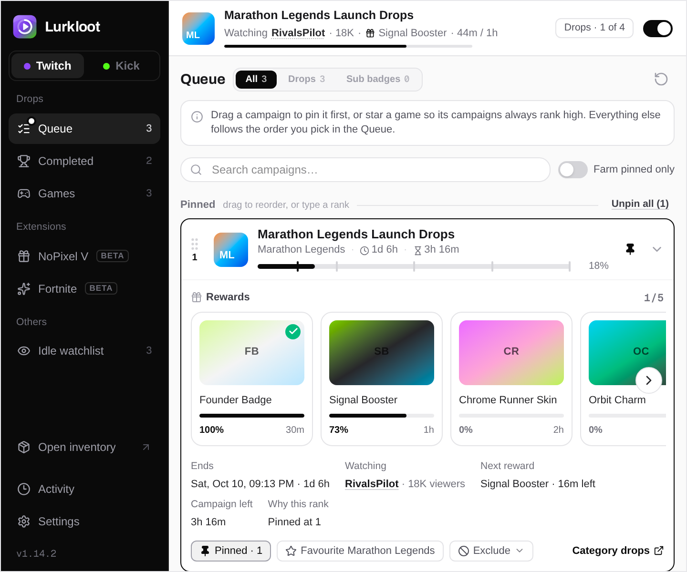

<p align="center">
  
</p>

<h1 align="center">Lurkloot</h1>

<p align="center">
  Farm Twitch and Kick rewards automatically.<br>
  It finds a live target, stays on it, switches when that target stops counting, and claims what you earn.
</p>

<p align="center">
  <a href="https://lurkloot.jamezrin.com">Website</a>
  ·
  <a href="https://chromewebstore.google.com/detail/lurkloot/aobaackpofkghaejdnnmpmeaiaoibhdn">Chrome Web Store</a>
  ·
  <a href="https://lurkloot.jamezrin.com/changelog">Changelog</a>
</p>

<p align="center">
  <picture>
    <source media="(prefers-color-scheme: dark)" srcset="docs/assets/readme/popup-dark.png">
    
  </picture>
</p>

<p align="center"><sub>Popup preview. The campaigns are sample data.</sub></p>

It is free, fully open source, and runs as a browser extension or, in beta, as a headless CLI with Docker.

## What it farms

**Twitch**

- Drops
- Subscriber badges
- Channel points
- Idle Watchlist
- Fortnite and NoPixel, through their Twitch channel extensions

**Kick**

- Drops
- Daily rewards
- Idle Watchlist

Each platform has its own switch, games, order, and channel list. Turn on one, or both.

## How it works

You sign in to Twitch or Kick as usual, enable the platform, and leave Lurkloot running. It detects what you can still earn, picks a live channel that counts toward it, and switches on its own when the stream goes offline, the reward finishes, or a better target becomes available.

Most watching happens in the background, with no stream video and no video ads. If a watch cannot continue that way, Lurkloot opens a muted tab for that channel. That tab plays the stream, so a platform ad can run there.

The popup is one workspace for both platforms. The queue shows what is being farmed. Pin campaigns and drag them into order, rank favourite games, limit farming to chosen categories, block categories, exclude channels, and choose which reward Lurkloot prefers when several are available.

When no drop, extension, or other reward is eligible, the Idle Watchlist takes over. Add the channels you want watched, and Lurkloot picks one that is live. On Kick, that watch time also counts toward your profile level and badges.

## Optional extras

Fortnite collects sprites and phase rewards. NoPixel earns daily packs and can join giveaways. Both stay off until you enable them in the popup, and enabling one asks the browser for access to that extension's site. Drop campaigns are still watched first unless you change the order.

## Compared with other miners

[TwitchDropsMiner](https://github.com/DevilXD/TwitchDropsMiner) is the usual desktop alternative. Around it are forks, rewrites in Go or Rust, command-line tools, and websites you host yourself with Docker. Starting those means a language runtime, a terminal, or a server.

Lurkloot is easier to set up. It installs from the Chrome Web Store into the browser you already use, and it uses the session you are already signed in with. Twitch and Kick share one popup. A beta CLI and Docker image run the same engine on a server when you want that instead.

## Install the extension

1. [Install Lurkloot from the Chrome Web Store](https://chromewebstore.google.com/detail/lurkloot/aobaackpofkghaejdnnmpmeaiaoibhdn). The same listing works in Chrome, Edge, Brave, Opera, and Vivaldi.
2. Sign in to Twitch, Kick, or both in that browser.
3. Open the Lurkloot popup and enable the platforms you want.

Farming starts on its own. Leave the browser running.

Firefox builds on [GitHub Releases](https://github.com/jamezrin/lurkloot/releases) are best-effort and untested. Testers are welcome — please [report what you find](https://github.com/jamezrin/lurkloot/issues/new?template=bug_report.yml).

To try a pre-release Chrome build, see [Installing a pre-release build](docs/install-prerelease.md).

## Run it without a browser

The CLI and Docker image are in beta. Twitch drop claiming from the CLI alone is not fully verified yet. They run the same farming engine on a server, a NAS, or any machine that can run a container. There is no browser window and no stream video. The published image is multi-architecture (`amd64` and `arm64`): [`ghcr.io/jamezrin/lurkloot-cli`](https://github.com/jamezrin/lurkloot/pkgs/container/lurkloot-cli).

Sign in once, then leave the container running. A Twitch device login looks like this:

```bash
docker run --rm -it -v "$PWD/data:/data" \
  ghcr.io/jamezrin/lurkloot-cli:latest auth twitch device-login
```

That login uses Twitch's Smart TV client, so it cannot see every drop campaign. For full Twitch discovery, export credentials from the extension with Settings → Export credentials and import that file. Kick login on the same image is `auth kick device-login`. Authentication, configuration, and the command that keeps farming in the background are in the [CLI guide](packages/cli/README.md).

Fortnite and NoPixel run in the extension. The CLI farms Twitch and Kick.

## Your account stays yours

The extension uses the Twitch and Kick sessions already in your browser. It does not ask for your password, and it does not send your activity to a Lurkloot server. There is no Lurkloot account and no telemetry. The only way session data leaves the extension is Settings → Export credentials, which you run yourself to set up the CLI. That writes a file on your machine. Details are in the [privacy policy](https://lurkloot.jamezrin.com/privacy).

## Help

If something is wrong, [open a bug report](https://github.com/jamezrin/lurkloot/issues/new?template=bug_report.yml). Include your browser, the platform, and what you expected to happen. Leave out passwords, cookies, and session tokens.

Ideas belong in a [feature request](https://github.com/jamezrin/lurkloot/issues/new?template=feature_request.yml).

## AI

Lurkloot is maintained by one person, using the best frontier models and workflows written for this repository. The models write most of the code. The maintainer owns the architecture, the design, and the product decisions. An issue or a pull request has to come from a person who has read it, checked it, and can discuss it. Low-effort and fully automated submissions are not welcome.

## Contributing

Bug reports, translations, documentation, and code are welcome. Pick the guide for the change you have in mind:

| Guide | Use it for |
| --- | --- |
| [Contributing](CONTRIBUTING.md) | Repository setup, branch and commit conventions, and the checks a pull request should pass |
| [Architecture](docs/architecture.md) | How the extension, farming engine, popup, and CLI fit together |
| [Translations](docs/translations.md) | Correcting a locale catalog |
| [CLI guide](packages/cli/README.md) | The headless runtime, auth, and Docker |
| [Releasing](RELEASING.md) | How versions are cut and published |

The source is licensed under the [Apache License 2.0](LICENSE).

## Disclaimer

Lurkloot is an independent project. It is not affiliated with, endorsed by, or sponsored by Twitch, Kick, Epic Games, or NoPixel. Platform behavior and terms can change, and automating viewing may be restricted by those terms. Use Lurkloot at your own discretion.
