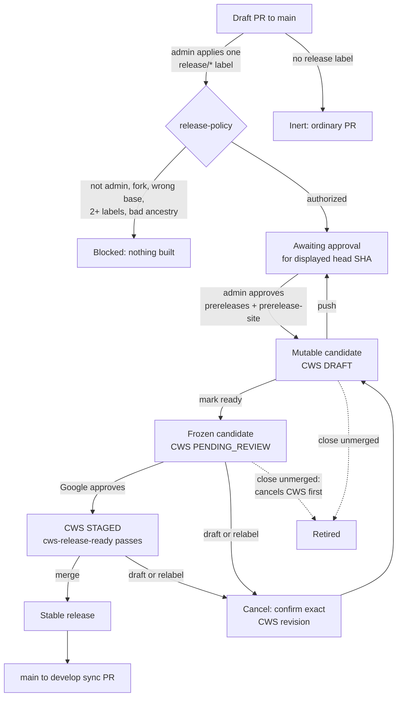

# Releasing Lurkloot

Releases are operated by pull requests to `main`. Normal releases contain a snapshot descended from `develop`; hotfixes contain a snapshot descended from `main` without commits exclusive to `develop`. The head branch name is never trusted as release authorization.

Do not enter versions, create or move tags, or run the old prepare/submit dispatches. Automation derives the next version from the stable version on `main` and the one authorized release label, and owns candidate tags, GitHub releases, Chrome Web Store (CWS) state, Docker aliases, and site deployments.

## Release lifecycle

A candidate is mutable until it is submitted to Chrome Web Store review. Submission freezes its source commit and artifacts; cancelling review makes it mutable again. The label authorizes building a candidate, a protected-environment approval bound to the displayed SHA authorizes publishing it, and merging the approved release PR is the irreversible stable-release boundary.

1. Create a branch from `develop` for a normal release or from `main` for a hotfix, then open a **draft** pull request to `main`. The branch may have any name.
2. Have a repository administrator apply exactly one release label:
   - `release/patch`, `release/minor`, or `release/major` for a normal release;
   - `release/hotfix` for a hotfix patch release.
3. Approve each protected candidate-environment deployment only after confirming that the deployment displays the current PR head SHA. Candidate publication uses `prereleases` and the preview deployment uses `prerelease-site`.
4. Inspect the mutable GitHub prerelease, Cloudflare Pages `next` site, CWS draft, and Docker candidate. The sticky PR status comment links the candidate state and records its checksums and source SHA.
5. Mark the PR ready for review. Submission begins automatically; approve the protected `cws-review` environment when requested and when it still displays the expected head SHA.
6. Wait for the bot's CWS **STAGED** notification and a passing `cws-release-ready` check. Google review is polled automatically.
7. Merge the PR after every required check passes. Approve `stable-releases` and `production-site` for the reviewed merge when requested, then verify CWS publication, the stable GitHub release, Docker aliases, production site, and the automatic `main` to `develop` synchronization PR.

Upload the Firefox ZIP and source ZIP from the stable GitHub release to AMO; AMO publication remains manual.

## Labels, authorization, and versioning

Exactly one of these labels activates release automation:

| Label | Release kind | Version from stable `X.Y.Z` |
| --- | --- | --- |
| `release/patch` | normal | `X.Y.(Z+1)` |
| `release/minor` | normal | `X.(Y+1).0` |
| `release/major` | normal | `(X+1).0.0` |
| `release/hotfix` | hotfix | `X.Y.(Z+1)` |

The actor applying or replacing the label must have repository administrator permission. A recognized label applied by anyone else remains visible but is inert: `release-policy` fails, no release artifact is created, and an administrator must remove and reapply it. Zero recognized labels means an ordinary PR; multiple recognized labels are invalid and cause reconciliation to retire or cancel an existing candidate safely.

Authorization is bound to the PR number, current head SHA, exact label, derived version, and authorizing administrator. A push changes the head SHA, invalidates the previous authorization and environment approvals, and requires administrators to approve candidate environments for the newly displayed SHA. A label replacement requires a fresh administrator label event. GitHub event payloads and branch names are only hints; workflows re-read live PR state and candidate metadata.

Normal heads must include the recorded `develop` snapshot. Hotfix heads must descend from `main` and exclude commits exclusive to `develop`. Fork pull requests are never eligible.

## Automatic reconciliation

The controller reacts to opening, reopening, pushing, labeling, unlabeling, converting to draft, marking ready, and closing a PR to `main`. It serializes work per PR, reads live state, and performs the minimum safe transition:

- A valid labeled draft PR prepares or refreshes a mutable candidate.
- A push while mutable rebuilds and replaces the candidate only after the new artifacts and SHA approval are valid; a failed replacement leaves the previous candidate intact.
- Marking the PR ready submits the exact candidate with staged publishing. `cws-release-ready` stays pending until CWS reports `STAGED` and the bot has added the single metadata-only finalization commit.
- Converting back to draft cancels an active submission before restoring a mutable candidate.
- Removing or replacing a label retires a mutable candidate. If it is submitted, automation first cancels and confirms the exact CWS revision, converts the PR to draft, and only then prepares a replacement.
- Closing without merging retires or cancels the candidate. Merging performs promotion only when the closed PR still has exactly one matching label and its PR number, source/finalization commits, candidate metadata, checks, checksums, tag, and CWS state all agree.
- Successful stable promotion publishes CWS, promotes the recorded Docker digests, converts the existing prerelease to stable, deploys production, and opens the `main` to `develop` synchronization PR.

Approvals reset on SHA changes so credentials cannot be used for code an administrator did not approve. Candidate-controlled build code runs without secrets; credentialed jobs use release tooling resolved from live `main` at an immutable SHA. Every privileged mutation revalidates the live PR head, exact label set, authorization, and candidate identity after its environment approval or concurrency lock.

If CWS cancellation is refused, the external version is unexpected, or publication state cannot be proved safe, reconciliation stops and the PR check/comment gives recovery guidance. Automation never overwrites an uncertain submitted revision, rebuilds stable artifacts, or force-moves a stable tag.

## Recovery

Normal releases require no manual workflow dispatch. Use recovery only after automatic reconciliation reports a partial or blocked operation:

- **Prepare prerelease** accepts only `pr_number`. It derives the version, kind, label, head SHA, authorization, and provenance again from the live PR and its candidate record.
- **Promote reviewed release** accepts only the single closed, merged `pr_number`. This is the sole manual promotion trigger and retries the same idempotent promotion; it cannot select a branch or version.
- **Refresh CWS status** normally needs no input and checks all active prereleases. An optional exact candidate `version` narrows an immediate refresh. Enable `recovery` only when continuing a documented partial promotion whose matching version is already `PUBLISHED`.

There is no manual submit or cancel entry point. Marking ready submits automatically; label, draft, push, and close events drive cancellation and retirement. Recovery never accepts `source_ref`, `release_kind`, a branch name, or an arbitrary replacement version. Stop and investigate any source SHA, merge SHA, label, tag, checksum, Docker digest, or CWS version mismatch.

## Required GitHub configuration

Before enabling the controller:

- Create exactly these operator labels: `release/patch`, `release/minor`, `release/major`, and `release/hotfix`. The bot-owned `release-forward-merge` label may also be created for synchronization PRs.
- Protect `main` and `develop`. Require pull requests and normal repository validation. On release PRs to `main`, require `release-policy`, `release-candidate`, `cws-release-ready`, and the normal validation checks; do not permit a merge while any is pending or failing.
- Create protected environments `prereleases`, `cws-review`, `prerelease-site`, `stable-releases`, and `production-site`. Restrict reviewers to repository administrators/release managers, enable prevent-self-review, and configure approvals so a changed deployment/candidate SHA invalidates the earlier approval and displays the SHA being approved.
- Store `CRX_PRIVATE_KEY`, `CWS_SERVICE_ACCOUNT_JSON`, `CLOUDFLARE_API_TOKEN`, and `CLOUDFLARE_ACCOUNT_ID` as secrets available only to their required protected environments/workflows. Set repository/environment variables `CWS_PUBLISHER_ID` and `CWS_EXTENSION_ID`. The service-account email must be a member of the CWS publisher, and the CRX key must be preserved permanently.
- Deny release credentials to fork PRs. Keep candidate builds credential-free and environment-gate signing, CWS mutations, GHCR candidate/stable writes, and Cloudflare deployments.
- Configure rules from PR identity, labels, checks, ancestry, and live SHAs only. Do not authorize `release/*`, `hotfix/*`, or any other branch-name prefix.
- Complete or cancel every active legacy candidate, synchronize the automation commit to both `main` and `develop`, configure all checks/environments, and then enable the controller. The old general-purpose prepare and submit dispatches are disabled after migration.

Repository configuration checklist for the migration PR:

- [ ] Create `release/patch`, `release/minor`, `release/major`, and `release/hotfix` labels.
- [ ] Require `release-policy`, `release-candidate`, `cws-release-ready`, and normal validation on `main` release PRs.
- [ ] Restrict protected-environment reviewers to repository administrators/release managers.
- [ ] Enable prevent-self-review and candidate-SHA approval invalidation.
- [ ] Confirm `prereleases`, `cws-review`, `prerelease-site`, `stable-releases`, and `production-site` secrets and variables.
- [ ] Complete or cancel every active legacy candidate before enabling the controller.
- [ ] Synchronize the automation commit to both `main` and `develop`.

## Release artifacts

The mutable GitHub prerelease and its `candidate.json` are the canonical candidate record. They identify the release PR, administrator authorization, label-derived version, stable/develop provenance, source and authorized SHAs, trusted tooling SHA, artifact checksums, Docker digests, CWS state, and preview deployment.

The ordinary `vVERSION` tag identifies the candidate. It may move only while the prerelease is mutable, freezes during CWS review, and becomes permanently immutable at stable promotion.
