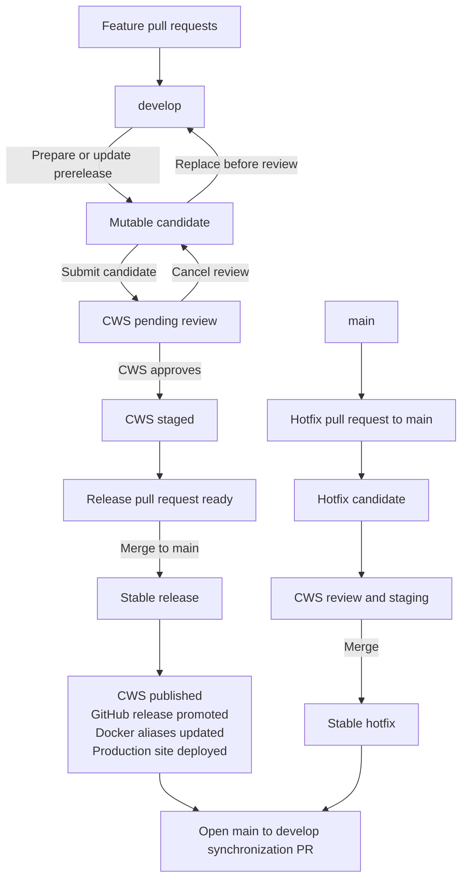

# Releasing Lurkloot

Releases are operated from GitHub. Normal releases take everything on `develop` at the release cut. Hotfixes start from `main`, so they can ship without unreleased `develop` changes.

Do not create or move release tags manually. The workflows own version tags, GitHub release assets, Chrome Web Store state, Docker aliases, and site deployments.

## Release lifecycle

A candidate is mutable until it is submitted to Chrome Web Store review. Submission freezes its source commit and artifacts. Cancelling review makes it mutable again. Merging the approved release PR is the irreversible stable-release boundary.

## Prepare a normal prerelease

1. Merge every intended change into `develop`.
2. Update the Unreleased entry in `packages/site/src/changelog.json`.
3. Open **Actions → Prepare prerelease → Run workflow**.
4. Enter the release version, leave `source_ref` as `develop`, and choose the normal release kind.
5. Wait for the workflow to build and verify the extension, publish candidate Docker digests, upload the CWS draft, deploy the preview site, and create or update the draft `release/VERSION → main` PR.
6. Review the workflow-owned comment on that PR. It records the source commit, artifact checksums, preview URL, GitHub prerelease, and CWS state.

Running **Prepare prerelease** again with the same version replaces the candidate from the current selected `develop` commit, but only while the CWS revision remains an unsubmitted draft.

The version may jump beyond the originally expected patch, minor, or major release. It must be greater than the newest stable version and any other active candidate. After the higher candidate upload succeeds, automation closes the older release PR and retains its GitHub prerelease as a cancelled audit record. Release labels can document the expected bump, but the explicit workflow version is authoritative.

## Submit and review a candidate

1. Inspect the preview site, GitHub prerelease assets, changelog, and CWS draft.
2. Open **Actions → Submit candidate → Run workflow**, enter the version, and approve the protected `cws-review` environment when prompted.
3. The workflow rebuilds the unsigned extension in a credential-free job, verifies that the normalized Chrome ZIP has the recorded SHA-256, verifies candidate provenance, and submits CWS with `STAGED_PUBLISH`. Deferred publishing is enforced by the API; there is no automatic-publishing checkbox to remember.
4. The release PR becomes ready for review and its `cws-release-ready` check remains pending.
5. A scheduled workflow polls CWS. Use **Actions → Refresh CWS status** for an immediate check.

The workflow comments only when the state changes and tags the user who prepared the release:

- `PENDING_REVIEW`: the candidate is frozen and waiting for Google.
- `STAGED`: CWS approved the candidate; the readiness check passes after release metadata is finalized.
- `REJECTED`, `CANCELLED`, policy warning, or takedown: the check fails with recovery guidance.

When CWS becomes staged, automation synchronizes package versions and dates the changelog in a tightly scoped release-metadata commit. Normal checks run again. No extension artifact is rebuilt.

## Promote a normal release

Approve and merge the `release/VERSION → main` PR after all required checks pass. The merge triggers promotion of the exact reviewed candidate; approve the protected `stable-releases` environment when GitHub requests final publication authorization:

1. Verify the release PR, candidate source, tag, CWS version, and stored checksums.
2. Publish the staged CWS revision.
3. Promote the stored Docker digests to stable aliases.
4. Convert the existing GitHub prerelease into the stable release.
5. Deploy the site to production.
6. Open a `main → develop` synchronization PR so the stable version/date metadata becomes the base of the next release.

Promotion is idempotent. If an external service fails after CWS publication, rerun promotion for the same merged release PR. Never rebuild or force-move a stable release.

After promotion, confirm CWS, GitHub Releases, Docker aliases, the production changelog, and the automatically opened synchronization PR. Merge that PR into `develop` before preparing the next normal release. Upload the Firefox ZIP and source ZIP from the GitHub release to AMO; AMO publication remains manual.

## Cancel, replace, or abandon a candidate

Open **Actions → Cancel candidate → Run workflow**, enter the version, and choose whether to keep or abandon it.

- **Keep mutable** cancels an active CWS review, returns the release PR to draft, and permits another candidate upload for the same version.
- **Abandon** cancels review when possible, closes the release PR, and marks the GitHub prerelease as cancelled while retaining its audit trail.

After cancellation, prepare the same version again or choose any higher valid version. A staged candidate is cancelled explicitly through the CWS API before it can be replaced; it is never silently overwritten.

## Release a hotfix

1. Create `hotfix/SHORT-DESCRIPTION` from `main`.
2. Open a PR from the hotfix branch to `main`. Do not merge `develop` into it.
3. Update the changelog and optionally apply `release/patch`, `release/minor`, or `release/major`.
4. Run **Prepare prerelease** with the explicit version, hotfix release kind, and hotfix PR number.
5. Review, submit, and wait for CWS staging exactly as for a normal candidate.
6. Merge the hotfix PR after `cws-release-ready` and the other required checks pass.

Stable promotion publishes the reviewed hotfix without any `develop` commits. As with a normal release, automation opens a `main → develop` synchronization PR so the fix and stable metadata are carried into the next normal release. Resolve that PR manually if it conflicts.

## Recovery rules

- Retry a failed candidate build; the previous candidate remains intact until replacement succeeds.
- Retry an upload or submission against the same checksummed artifact.
- Refreshing CWS status never mutates a candidate.
- Rerun partial stable promotion only for the same merged PR and candidate metadata.
- A matching CWS `PUBLISHED` state is accepted during partial-publication recovery.
- Stop and investigate any stable tag, source SHA, artifact checksum, Docker digest, or CWS version mismatch.
- Never force-move a stable tag or rebuild a stable version from different code.

## Repository configuration

For a new installation, create `develop` once from the current `main` head, apply the same validation protection, and direct feature and Renovate PRs to `develop`. During migration of this workflow itself, synchronize `main` back into `develop` immediately after the bootstrap PR merges so both branches contain the release automation before preparing the first candidate.

The repository requires:

- protected `main` and `develop` branches;
- required validation and `cws-release-ready` checks on release and hotfix PRs;
- `prereleases`, `cws-review`, `stable-releases`, `prerelease-site`, and `production-site` environments;
- `CRX_PRIVATE_KEY`, `CWS_SERVICE_ACCOUNT_JSON`, `CLOUDFLARE_API_TOKEN`, and `CLOUDFLARE_ACCOUNT_ID` secrets; candidate builds run in separate jobs that cannot access these credentials;
- `CWS_PUBLISHER_ID` and `CWS_EXTENSION_ID` variables;
- optional `release/patch`, `release/minor`, and `release/major` labels, plus the automation-owned `release-forward-merge` label.

The CWS service-account email must be a member of the publisher. Preserve the CRX private key permanently because replacing it changes the sideloaded extension identity. Pull requests from forks must never receive release credentials.

## Release artifacts

GitHub Releases are the canonical artifact store. Each candidate records the signed Chrome CRX, Chrome ZIP, Firefox ZIP, Firefox source ZIP, `SHA256SUMS`, candidate metadata, Docker digests, source commit, release PR, initiating user, CWS state, and preview deployment.

The ordinary `vVERSION` tag identifies the candidate and replaces the former dedicated CWS candidate tag. It may move only while the prerelease is mutable. It freezes during review and becomes permanently immutable at stable promotion.
