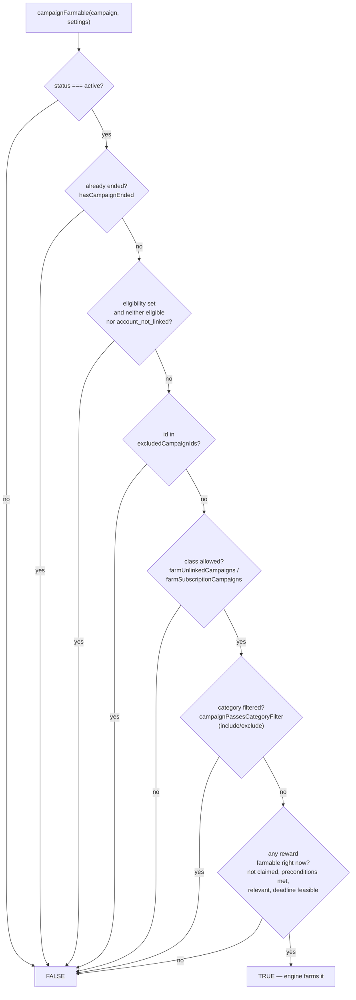
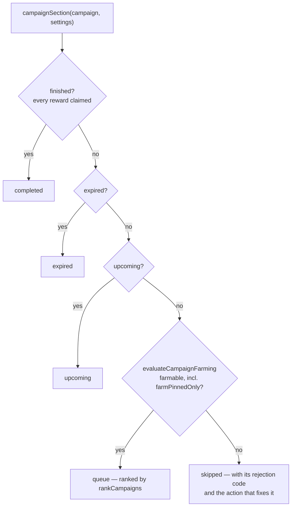

# Farmability & Visibility — shared campaign evaluation

Two questions, one shared foundation.

- `evaluateCampaignFarming` answers **"will the engine actually watch this, and if not, why?"**
- `campaignFarmable` is the boolean compatibility wrapper around that evaluation.
- `campaignSection` answers **"which of the popup's lists does it belong in?"**

Both are built from the same `campaignEligibleClass` check, so a campaign the
engine is farming is always in the Queue, in front of the person watching it
happen.

## 1. Can the engine farm it right now? — `campaignFarmable`

Used by the scheduler's `isEligible`. Six structural gates, then one timing
gate on the rewards themselves.

Account linking does not block watch progress on either platform.
`farmUnlinkedCampaigns` controls whether unlinked campaigns are farmed; their
linking status remains visible so users can connect their game account for delivery.

`evaluateCampaignFarming` applies these gates and returns either
`{ farmable: true }` or one stable rejection code plus relevant context such
as the blocked reward and deadline. `campaignFarmable` delegates to it and
returns only the boolean result.

The scheduler aggregates these results after each refresh (including an
explicit `0 farmable` count) and emits per-campaign diagnostics for active
rejections. A fingerprint suppresses identical snapshots until campaign data
or settings change. The popup evaluates the same campaign with priority mode
included, showing a compact warning on collapsed cards and the localized full
reason when expanded.

## 2. Is it in a farmable class at all? — `campaignEligibleClass`

The first six gates above, on their own, ignoring reward timing entirely —
just "does this campaign have anything left to earn or claim." This is the
shape both farmability and visibility are built from.

> **Why split it out:** a campaign can fail the reward-timing gate (deadline
> too tight, a locked follow-up reward) without being structurally dead. The
> popup keeps listing it — under Skipped, with the reason — so the user can act
> on that reason (here, ease the deadline margin) rather than hunt for a
> campaign that silently vanished. Each Skipped row offers the action its own
> rejection code calls for; pinning is the one for `not_pinned`, and it never
> rescues a campaign another gate refused.

## 3. Which list does the popup put it in? — `campaignSection`

Every campaign lands in exactly one section, so none is missing and none is in
two. Lifecycle first, then the engine's own farmability answer.

The Queue renders its rows grouped by ranking tier (pinned, favourite games,
then the live strategy). Skipped and Upcoming sit below it, collapsed. Completed
and Expired are their own destination, where a row shows one terminal state and
no rank, drag handle, progress or warning.

## Reference

| function | answers | used by |
|---|---|---|
| `evaluateCampaignFarming` | can it be farmed now; if not, what stable rejection code and context explain why? | scheduler diagnostics, popup view model, `campaignFarmable` |
| `campaignEligibleClass` | could this campaign's class ever be farmed, ignoring reward timing? | `campaignFarmable`, `campaignSection` |
| `campaignFarmable` | eligible class, and a reward is farmable right this moment | `isEligible` (scheduler) |
| `campaignSection` | which popup list does this campaign belong in? | the popup (`Popup.tsx`, `queue.tsx`, `completed.tsx`) |
| `rankCampaigns` | in which order are the farmable ones tried? | the scheduler and the Queue |
| `isRewardFarmableNow` | not claimed, preconditions met, in its window, deadline feasible | `campaignFarmable` |
| `campaignPassesFarmingEligibility` | is this campaign's class (not-linked / subscription) allowed at all? | `campaignEligibleClass` |

## The relationship that matters most

`campaignEligibleClass` is the shared base.

- `campaignFarmable` = that base **+** one extra reward-timing check (used
  for actual farming decisions).
- `campaignSection` uses the full farmability answer to separate Queue from
  Skipped, and the base is what guarantees the two can never disagree about a
  campaign the engine is farming. A campaign that is momentarily un-farmable for
  timing reasons (tight deadline, unmet precondition) is skipped rather than
  hidden, with the reason on the row.

---
*Source: `packages/shared/src/campaignFarming.ts`, `packages/shared/src/campaignFilters.ts`, `packages/shared/src/ranking.ts`, `packages/shared/src/rewards.ts`*
