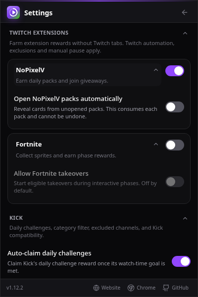

# Twitch Extension foundation (#507)

The integration runs fully tabless. Authorization acquisition and provider
activity use the privileged background; neither requires a Twitch tab or an
overlay iframe. Work is tracked in draft #541. The popup exposes independent provider opt-ins
and separate collapsible NoPixelV/Fortnite drop sections as soon as each is enabled; the
watch status row contains the current channel and selection reason. takeover actions have a separate opt-in, off by default.

The authoritative design, public protocol evidence and credential-safe live
validation instructions are in
[the tabless design](../superpowers/specs/2026-09-12-tabless-twitch-extensions-design.md).

## Implemented

- Browser-free descriptors contain optional backend origins, discovery
  categories and refresh floors. Frame registration/relay/protocol code is removed.
- The selected-channel session source uses Twitch's shipped
  `CoordinatorExtensionsForChannel` fields through the existing browser session
  fetcher. It does not acquire page context or create an integrity tab. Active
  installation, channel binding, viewer role, linked identity and expiry are
  checked; provider backends still perform cryptographic verification.
- Credentials stay within the privileged source/driver callback. Only bounded
  outcomes and validated reports reach the host. Discarded report fields are
  screened too, and summaries contain only known enum values and counters.
- The runtime coalesces channel initialization, bounds polling, renews expiring
  sessions on reconciliation and stops resources at authorization expiry.
  Stop/channel change/revocation/logout discard late session, driver and report
  results. Failed initialization aborts signal-bound resources immediately.
- Permission gating requests backend access directly from an enable gesture;
  background enable verifies a pregranted origin. Denial leaves a provider off.
  Startup verifies grants, revocation stops resources before async cleanup, and
  stale grants/verification cannot restart disabled resources.
- Background startup/wake, alarms, settings/scheduler changes, credential
  changes and permission removal reconcile the runtime. Snapshots attach cloned
  transient summaries; no active provider session is restored from storage.
- Browser-only settings default NoPixelV, Fortnite and takeovers off. CLI config
  rejects those keys. Required browser grants are unchanged; both vendor
  backends are optional.
- The NoPixel 1.1.2 driver uses Bearer auth, an initialization ping, channel
  setup, daily-watchtime reads and giveaway join/refetch. Joins are reported
  only after server membership confirms them. Definite HTTP failures can retry;
  ambiguous submissions remain guarded. Pack delivery is read separately from `/cards/packs`; watchtime completion
  does not prove issuance. A separate default-off `autoOpenPacks` opt-in uses
  `/cards/packs/{packId}/open`, at most five previously unattempted packs per
  refresh. Valid returned cards plus a reread confirming removal are required
  for activity. Ambiguous openings are guarded within the lease; cancellation
  suppresses late activity and private pack/card data never reaches reports.

- Independent discovery makes bounded directory and installation-list requests;
  it never obtains per-candidate viewer JWTs. A five-minute cache bounds scans.
  NoPixelV gets the supplemental lane first, then Fortnite; completed providers
  release it, and unavailable channels back off. Ordinary drops resume afterward.
  Normal healthy channel changes cancel active resources while preserving completed
  public summaries and their bounded cooldowns. Authority loss/reset clears them.
- The browser-free scheduler accepts a host-supplied supplemental target after
  platform, authentication and manual-pause gates. Supplemental targets have
  their own heartbeat identity without invented campaign/reward IDs. Their
  tabless-only restriction disables fallback to watch tabs and cannot be lost
  through ambiguous ordinary campaign discovery.
- Fortnite repeats hello/authenticate/join and state reads on bounded reconnect.
  The reducer consumes versioned states, rejects incompatible updates atomically,
  and retains earning fields only. Captures follow observed server sprites and
  cadence; uncertain submissions are guarded across reconnect. Only authoritative
  participant count increments generate capture activity.
- Opted-in takeovers require server READY eligibility, an open interactive phase,
  channel permission and an expired cooldown. Ambiguous attempts are not replayed.
  Bounded ownership reads confirm activity; transient reads can retry. No reward-
  seen mutation is sent. Collection completion is distinct from earned rewards.
- Chromium builds require Chrome 116+ for normal WebSocket traffic to maintain
  the MV3 worker. Firefox uses its persistent MV2 background page.

## Remaining

Authenticated background session acquisition passed the user-run read-only
popup check for both providers: HTTP 200, no GQL errors, active installation,
viewer token present, authenticated viewer and linked identity. Only public
metadata and booleans were shared. This verifies authorization acquisition,
not vendor earning. A subsequent user-run tabless NoPixelV log records a
server-confirmed giveaway join on `ssaab` at 2026-09-13T09:52:49.580Z, after
the lane moved past temporarily unavailable `hazan`. Daily watchtime growth and
Fortnite earning still need live confirmation; the unavailable-channel cause
is identified as HTTP 404 from `/channel/giveaway`. Giveaway failures now
mark only that action unavailable and preserve valid daily-pack progress;
404 is not interpreted as proof of an absent giveaway. The user screenshot
shows an authoritative daily-pack counter of 60/60, but its growth during
the tabless run has not yet been observed.
Tracking issues #507–#511 remain open for authenticated lifecycle and earning
acceptance. Synthetic tests and anonymous protocol reads do not satisfy that gate.
Both Fortnite issues are implemented together in the draft.

Provider JWTs and vendor device/session properties stay in memory. They never
enter settings, snapshots, messages, activity, diagnostics or exports. No hidden
frames, CSP modification, Origin spoofing, credential export or platform
detection bypass is part of this design.

## NoPixel evidence

The published NoPixel 1.1.2 bundles use `Authorization: Bearer ...` and expose
`/ping`, `/channel/setup`, `/cards/rewards/daily-watchtime/progress`,
`/channel/giveaway` and `/channel/giveaway/join`. The collection hook reads
`watch_time_earned` and `watch_time_required`; the giveaway hook refetches after
joining and reads `has_user_entered_giveaway`. The initialization ping is a
stale-forever read enabled for a linked viewer. The collection progress hook
currently refreshes every ten seconds; LurkLoot conservatively polls no faster
than once per minute.

Public source base:
`https://nstuq90nghenyqwqme61jgvmtp253a.ext-twitch.tv/nstuq90nghenyqwqme61jgvmtp253a/1.1.2/3d6b2e718e0d4f67822b75a68ca922b7/assets/`.
Relevant bundled assets: `Alert-D-LPMaDd.js`, `TwatterView-C2JjPIqz.js`,
`useGiveaway--y3iy8yN.js`. Tests use synthetic schemas, never live responses.

## Fortnite live schema evidence

A disposable Chromium extension-origin page on 2026-09-13, with no Twitch tab,
completed ordinary hello. Its anonymous authorization and join were rejected,
while public campaign/competition/phase/reward/catalog reads succeeded. The
actual response is `{ states: [{ type, key, version, state }] }`, not a direct
phase array. Phases include numeric `rewardThreshold`, `startsAt`,
`endInteractiveAt`, `endsAt`, and participation/completion reward IDs. The
catalog uses `epic.twitch.collectable`; rewards use `epic.clientreward`.
Only field types and collection sizes were recorded, never credentials or
vendor properties. Private participant/channel reads and actual earning were
not verified by this anonymous probe.

## Live acceptance with the installed worktree build

1. Build this worktree and load `packages/extension/.output/chrome-mv3` as an
   unpacked extension. Keep the normal Twitch login; close all Twitch channel
   tabs. The popup can be opened from the extension toolbar.
2. Run the read-only authenticated probe in the linked design. Share only its
   provider IDs and booleans; never copy raw requests, JWTs or vendor properties.
3. Enable Twitch automation and NoPixelV in Settings → Twitch extensions, and
   grant its backend access. Check the status channel and daily-pack counter
   over several minute heartbeats. Record only counter values and whether the
   count increased. A giveaway is joined only when it is open; activity must
   correspond to server-confirmed membership.
4. Disable NoPixelV, enable Fortnite and grant its backend. During an open
   interactive phase, check that collection progress increases and confirmed
   capture activity appears. Account-link and closed-phase states are expected
   setup/availability outcomes, not proof of successful earning.
5. Leave takeovers off unless you explicitly want those actions. Test disabling,
   manual pause, permission revocation, logout and browser/worker restart: resources
   must stop promptly and may recover only when their authority is restored.

Share only statuses, counters and outcome booleans. Do not share network dumps,
console objects containing credentials, cookies or vendor session properties.

## Reward delivery and opening

NoPixelV's published client reads owned unopened packs and opens them to reveal
cards; no separate daily reward claim command was found in its shipped API
client. LurkLoot now says **Watchtime complete**, displays unopened pack counts
when readable, and distinguishes unavailable delivery reads from giveaways.
Opted-in automatic opening consumes the user's unopened packs and cannot be
undone. It does not assert that a particular pack was issued for today's
watchtime merely because the counter is full.

Fortnite's shipped reward commands are `reward.list`, `participant.get`,
`participant.getParticipantPhase`, `participant.submitCapture` and the cosmetic
`participant.setRewardsSeen`. No separate earning claim command was found;
LurkLoot observes server reward state instead of inventing one, and does not
send the cosmetic mutation. Actual automatic pack opening and Fortnite reward
delivery remain live acceptance checks, not established by synthetic tests.
